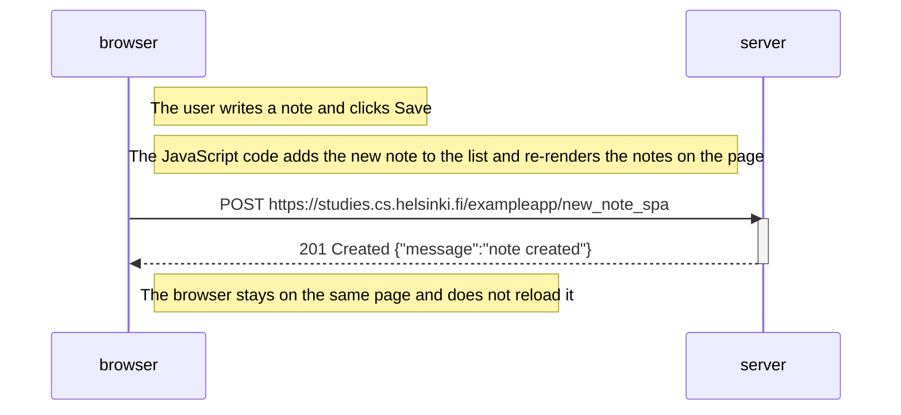

```mermaid
sequenceDiagram
    participant browser
    participant server

    Note right of browser: The user writes a note and clicks Save

    Note right of browser: The JavaScript code adds the new note to the list and re-renders the notes on the page

    browser->>server: POST https://studies.cs.helsinki.fi/exampleapp/new_note_spa
    activate server
    server-->>browser: 201 Created {"message":"note created"}
    deactivate server

    Note right of browser: The browser stays on the same page and does not reload it
```
